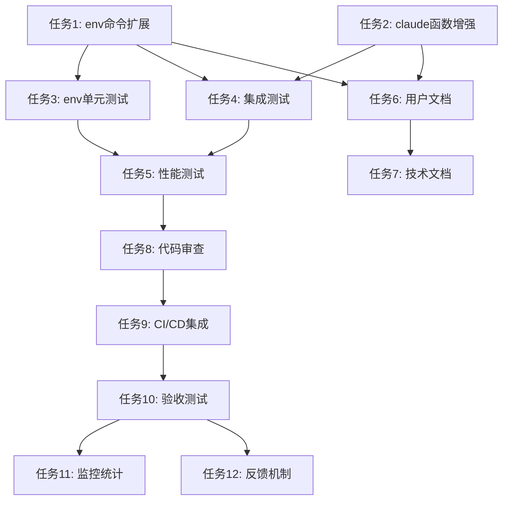

# 临时Provider切换功能 - 开发任务清单

## 任务执行指引

本任务清单采用**测试驱动开发(TDD)模式**，按照"测试先行→实现功能→集成测试"的顺序进行。每个任务都标注了推荐的执行方式和负责Agent。

### Agent协作矩阵
| 任务类型 | 推荐Agent/命令 | 职责 |
|---------|----------------|------|
| 核心功能开发 | `backend-dev` | API接口和核心逻辑实现 |
| Shell脚本开发 | `developer` | 跨平台shell脚本编写 |
| 测试设计&执行 | `test-runner` | 测试用例设计和执行 |
| 问题调试 | `debugger` | 问题诊断和性能分析 |
| Bug修复 | `code-fixer` | 最小化代码修复 |
| 文档生成 | `doc-writer` | 技术文档和用户指南 |
| 代码审查 | `reviewer` | 代码质量和安全检查 |

---

## 📋 开发任务清单

### Phase 1: 核心功能实现

#### ✅ 任务 1: 扩展 ccvm env 命令支持 --provider 参数
**负责**: `backend-dev` agent
**文件**: `bin/ccvm.js:732-775`
**目标**: 为 env 命令添加 `--provider <alias>` 选项支持

**实施步骤**:
1. 在 env 命令定义中添加 `--provider` 选项
2. 修改 action 函数，支持从选项中获取 provider 参数
3. 添加 provider 存在性验证逻辑
4. 实现根据指定 provider 输出环境变量的逻辑
5. 增强错误处理，提供清晰的错误信息和修复建议

**验收标准**:
- `ccvm env --provider test-provider` 输出正确的环境变量
- `ccvm env --provider nonexistent` 返回友好的错误信息
- 向后兼容：`ccvm env` 行为保持不变

---

#### ✅ 任务 2: 增强 claude shell 函数支持参数解析
**负责**: `developer` agent
**文件**: `install.sh:349-366`
**目标**: 修改 claude shell 函数，支持 `-P` 和 `--provider` 参数解析

**实施步骤**:
1. 实现参数解析循环，识别 `-P` 和 `--provider` 参数
2. 分离 CCVM 参数与原生 claude 参数
3. 添加参数验证（非空检查、格式验证）
4. 实现条件化的 `ccvm env` 调用（带或不带 --provider）
5. 增强错误处理和用户提示

**验收标准**:
- `claude -P test-provider "prompt"` 正确切换到指定 provider
- `claude --provider test-provider "prompt"` 与短参数行为一致
- `claude -P test-provider -p "prompt"` 正确组合使用参数
- 参数解析错误时给出清晰的错误信息

---

### Phase 2: 测试覆盖

#### ✅ 任务 3: 编写 env 命令 --provider 参数的单元测试
**负责**: `test-runner` agent
**文件**: `tests/unit/bin/ccvm-commands.test.js`
**目标**: 为扩展的 env 命令添加全面的单元测试

**测试用例**:
```javascript
describe('env command --provider option', () => {
  test('应正确输出指定provider的环境变量');
  test('指定不存在的provider应返回错误');
  test('--provider参数与--shell参数组合使用');
  test('不同shell格式的环境变量输出');
  test('provider参数为空时的错误处理');
});
```

**实施重点**:
- 覆盖正常流程和异常流程
- 测试不同 shell 格式的输出差异
- 验证错误信息的准确性和友好性

---

#### ✅ 任务 4: 编写 claude 函数参数解析的集成测试
**负责**: `test-runner` agent
**文件**: `tests/integration/claude-temp-provider.test.js` (新建)
**目标**: 测试完整的临时 provider 切换流程

**测试场景**:
```bash
# 测试脚本核心场景
test_temp_provider_basic()     # 基本切换功能
test_temp_provider_error()     # 错误处理
test_parameter_combinations()  # 参数组合
test_shell_compatibility()    # Shell兼容性
test_backward_compatibility() # 向后兼容
```

**验收重点**:
- 端到端流程验证
- 多种参数组合测试
- 错误恢复机制验证

---

#### ✅ 任务 5: 性能基准测试和优化
**负责**: `debugger` agent
**文件**: `tests/performance/temp-provider-perf.test.js` (新建)
**目标**: 验证临时切换功能的性能影响

**性能指标**:
- 参数解析时间 < 50ms
- Provider配置加载时间 < 100ms
- 总启动开销 < 200ms (相比原来增加不超过50ms)

**优化重点**:
- Shell 函数参数解析效率
- Provider 配置缓存策略
- 错误检查的性能影响

---

### Phase 3: 用户体验和文档

#### ✅ 任务 6: 更新用户文档和使用示例
**负责**: `doc-writer` agent
**文件**: `README.md`, `README.zh.md`
**目标**: 更新项目文档，添加临时 provider 切换功能的说明

**文档更新内容**:
1. 在"快速开始"章节添加临时切换示例
2. 创建"高级用法"章节，详细说明参数组合
3. 添加故障排除指南
4. 更新命令参考文档

**示例内容**:
```markdown
### 临时 Provider 切换

无需修改默认配置，临时切换到其他 Provider：

```bash
# 临时使用指定的 Provider
claude -P anthropic-cn "帮我分析这段代码"
claude --provider backup-api "翻译这个文档"

# 与其他参数组合使用
claude -P test-provider --debug "调试这个问题"
claude --provider custom-api -p "生成 API 文档"
```
```

---

#### ✅ 任务 7: 更新项目技术文档
**负责**: `doc-writer` agent
**文件**: `CLAUDE.md`
**目标**: 在项目的 Claude 指导文档中添加新功能说明

**更新内容**:
- 在"Common Development Commands"添加新的使用模式
- 更新架构说明，描述临时切换机制
- 添加开发者注意事项

---

### Phase 4: 质量保障和部署

#### ✅ 任务 8: 代码安全审查和质量检查
**负责**: `reviewer` agent
**目标**: 全面审查代码质量、安全性和最佳实践合规性

**审查重点**:
- **安全性**: 参数注入攻击防护，provider名称验证
- **错误处理**: 异常情况的优雅处理和用户友好提示
- **性能**: 避免不必要的文件IO和进程创建
- **兼容性**: 跨Shell和跨平台兼容性
- **代码质量**: 遵循项目编码规范，适当的注释和文档

**输出物**:
- 安全审查报告
- 性能分析报告  
- 代码改进建议清单

---

#### ✅ 任务 9: 集成现有CI/CD流程
**负责**: `developer` agent
**文件**: 测试配置文件
**目标**: 确保新功能纳入现有的测试和质量检查流程

**集成点**:
1. 添加到 `npm test` 测试套件
2. 确保 `npm run lint` 通过
3. 验证 `npm run format` 代码格式化
4. 集成到 `tools/integration-test.js`

**验证命令**:
```bash
npm test                    # 运行所有测试
npm run test:coverage      # 验证代码覆盖率
npm run lint               # 代码规范检查
npm run prepack           # 预发布检查
```

---

#### ✅ 任务 10: 用户验收测试和反馈收集
**负责**: `test-runner` agent
**目标**: 模拟真实用户场景，验证功能的实用性和易用性

**测试场景**:
1. **新用户场景**: 首次安装后的使用体验
2. **高级用户场景**: 复杂参数组合和边界情况
3. **错误恢复场景**: 各种错误情况的用户体验
4. **性能压力场景**: 频繁切换的性能表现

**验收标准**:
- 用户能够在5分钟内学会使用临时切换功能
- 错误情况下，用户能够根据提示快速修复问题
- 功能使用不会明显影响原有工作流程效率

---

### Phase 5: 监控和维护

#### ✅ 任务 11: 实施可选的使用统计和监控
**负责**: `backend-dev` agent
**文件**: `src/utils/analytics.js` (新建，可选)
**目标**: 添加可选的功能使用统计，帮助后续改进

**统计指标**:
- 临时切换功能使用频率
- 最常用的 provider 组合
- 错误类型和频率分布
- 性能指标趋势

**隐私保护**:
- 完全可选，默认关闭
- 不收集具体的 prompt 内容或 API key
- 提供清晰的数据删除方法

---

#### ✅ 任务 12: 建立问题反馈和改进机制  
**负责**: `doc-writer` agent
**目标**: 为新功能建立用户反馈收集和持续改进机制

**反馈渠道**:
1. GitHub Issues 标签分类
2. 用户使用指南中的反馈链接
3. CLI 工具中的反馈命令（如 `ccvm feedback`）

**改进计划**:
- 每月审查用户反馈
- 优先级排序和版本规划
- 性能和易用性持续优化

---

## 🚀 执行时间规划

### 开发周期估算
- **Phase 1 (核心功能)**: 2-3 天
- **Phase 2 (测试覆盖)**: 2 天  
- **Phase 3 (文档更新)**: 1 天
- **Phase 4 (质量保障)**: 1 天
- **Phase 5 (监控维护)**: 0.5 天

**总计**: 约 6.5-7.5 个开发日

### 任务依赖关系



### 关键路径
**T1 → T4 → T5 → T8 → T9 → T10** 为关键路径，需优先保证这些任务的及时完成。

## 📊 成功指标

### 功能性指标
- [ ] 所有验收标准通过率 100%
- [ ] 单元测试覆盖率 ≥ 90%
- [ ] 集成测试通过率 100%

### 性能指标  
- [ ] 命令启动延迟增加 < 50ms
- [ ] 参数解析时间 < 50ms
- [ ] Provider配置加载 < 100ms

### 用户体验指标
- [ ] 错误信息清晰度评分 ≥ 4.5/5.0
- [ ] 学习曲线：新用户5分钟内掌握使用
- [ ] 向后兼容性：现有用户零学习成本

### 代码质量指标
- [ ] ESLint 检查 0 error, 0 warning
- [ ] 安全漏洞扫描 0 critical issues
- [ ] 代码审查通过，无阻塞性问题

---

## 🔧 开发环境准备

执行任务前请确保：

1. **开发依赖**:
   ```bash
   npm install  # 安装项目依赖
   npm run lint # 验证代码规范工具
   ```

2. **测试环境**:
   ```bash
   # 创建测试用的provider配置
   ccvm add test-provider test-key https://test.api.com
   ccvm add backup-provider backup-key https://backup.api.com
   ```

3. **Shell测试环境**:
   ```bash
   # 确保测试覆盖主要Shell
   bash --version   # >= 4.0
   zsh --version    # >= 5.0  
   fish --version   # >= 3.0 (如果可用)
   ```

开始执行任务时，建议按顺序使用推荐的Agent，每完成一个任务及时更新清单状态。

---

*本任务清单遵循测试驱动开发原则，确保每个功能都有相应的测试保护，提高代码质量和维护性。*